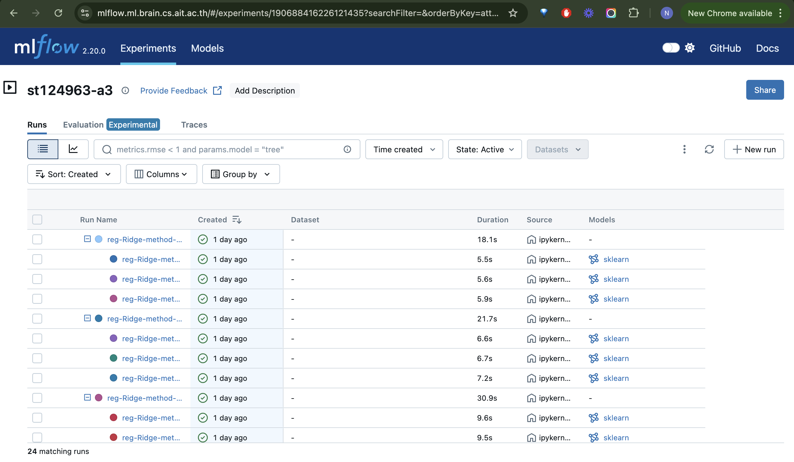

# A3-predicting-car-price

**Name:** Neha Shrestha
**Student Id:** st124963

#### URL: 
The website is live at: [https://carpricepredictor-st124963a3.ml.brain.cs.ait.ac.th/](https://carpricepredictor-st124963a3.ml.brain.cs.ait.ac.th/)


The file can be runned locally following the below steps:
1. After clonning the repository navigate to the project directory
2. Activate the virtual environment 
3. Install dependencies 
4. Run the dash application using:
```
python app/app.py
```

#### Screenshots


